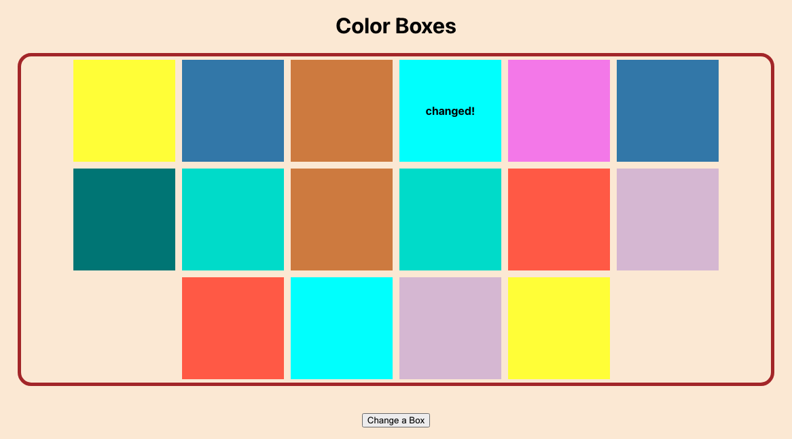

# Color Boxes App

This project was bootstrapped with [Create React App](https://github.com/facebook/create-react-app).

There is a series of 16 boxes. At the bottom of all of the boxes there is a button labeled “Change a Box”.
Initially, each box has a background color chosen from a random list of colors.  

When you click the button:  
- it selects a random box.  
- it changes the background color of that random box to a new color from the possible colors list. When a box just changed, it shows “changed!” inside. That text goes away after the next click.

